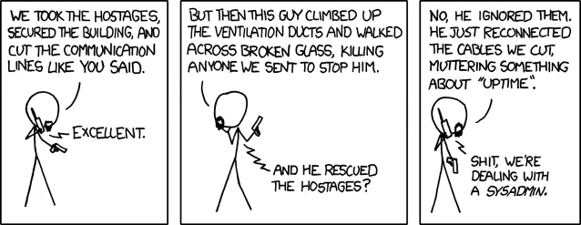

Today, July 28th, 2023, is [System Administrator Appreciation Day](https://sysadminday.com/). A day I didn't know existed until now but has been around since [2000](https://en.wikipedia.org/wiki/System_Administrator_Appreciation_Day).

It was during one of my first paid technical positions that I realized that sys admins, and other support staff including non-technical, can be a thankless job. A job where your only interactions with others is when something goes wrong.

During university I had a summer job as a Systems Analyst Trainee at [TELUS](https://en.wikipedia.org/wiki/Telus) Advertising Services (TAS). TAS was division of TELUS that created the [phone books](https://en.wikipedia.org/wiki/Telephone_directory), both white (residential) and [yellow](https://en.wikipedia.org/wiki/Yellow_pages) (businesses) pages. I did typical IT tasks at the time such as setting up new computers with token ring network cards and helping staff issues such as accessing email. Also lots of printer issues.



I did get some thank-yous when I helped someone but most of the time it was complaints. Something was not working and it was causing the person stress, which is understandable, but did lead negative interactions. It wares you down when you have more negative then positive interactions.

It's so easy to get used to something, start taking it for granted, then get frustrated when it's not there. For example, we just assume we will be able to connect to the internet wherever we are. Home, driving, store, airplanes, etc. This is relatively new phenomena but already people complain when they don't have internet for even a minute. Myself included.

So spend a couple minutes today thanking the Sys Admins that make your life better. Both at home and at work. You don't have to go as far as this A.J. Jacobs did and tried to thank [everyone](https://www.npr.org/2021/02/19/969148456/a-j-jacobs-whats-the-power-of-a-simple-thank-you) who made his mooring cup of coffee but a couple thank-yous would be much appreciated.

In my case I would like to thank the admins who make it possible for me to be a Software Consultant. Thank you to the admins at [Shaw](https://www.shaw.ca/) who keep me connected to the internet. Thank you to the admins at [Google](https://www.google.com/), [Slack](https://slack.com/), and [Discord](https://discord.com/) who let me communicate with clients and store information. Finally thank you admins at [WP Engine](https://wpengine.com/) who host this blog you are reading.

