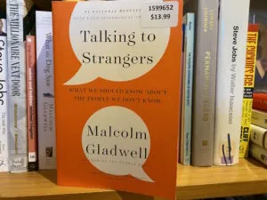

**Book:** [Talking to Strangers](https://www.gladwellbooks.com/titles/malcolm-gladwell/talking-to-strangers/9780316478526/)  
**Author:** [Malcolm Gladwell](https://www.gladwellbooks.com/)

This book has a lot of stories that include a police stop gone wrong, pyramid scheme, Cuban spies, drinking, sexual assault, and torture. A bit hard to follow all the different stories and pick out a theme for the book. At least for me.

My biggest takeaway was finding the balance between trust and doubt. The book points out that most humans are wired to [trust by default](https://en.wikipedia.org/wiki/Truth-default_theory). We believe what others say and this trust can override nagging doubts.

At first this seems like a bad thing that we humans are so trusting but the book does a good job of highlighting an example of someone who has doubts by default. In the story about [Bernie Madoff](https://en.wikipedia.org/wiki/Bernie_Madoff), who ran the largest Ponzi scheme in history, [Harry Markopolos](https://en.wikipedia.org/wiki/Harry_Markopolos) noticed right away that something was wrong with Madoff's investments but had trouble convincing people. He started getting paranoid and not trusting anyone which, from my take, made it harder from him to find people to report his suspicions of Madoff too and likely made it hard for the people he did contact to believe him. The chapter ends with the lines:

> Then he \[Markopolos\] dug out his gas mask from his army days. What if they came in using tear gas? He sat at home, guns at the ready - while the rest of us calmly went about our business.

I am too trusting by default and got burned a couple times. For example, contractors working on our home. I ignored the signs and ended up with a partially completed basement reno with lots of problems I had to fix myself or hire someone else to fix.

This book was good reminder to listen to my gut feel that something is not right. Politely but firmly push back and verify if my gut feelings are correct or not. Especially for items that will have a big impact on my life, such as expensive renovation. Just don't take it too far so I mistrust everyone and end up holed up in my house with guns at the ready.
