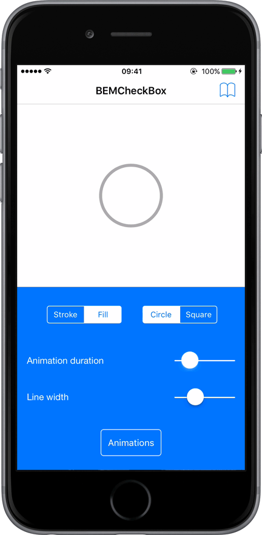

I'm pleased to announce that [v2.1.0](https://github.com/saturdaymp/BEMCheckBox/releases/tag/v2.1.0) of the [BEMCheckBox](https://github.com/saturdaymp/BEMCheckBox) has been released! This release adds basic accessibility support and updates the minimum iOS version from 12 to 18. More details can be found in the [release notes](https://github.com/saturdaymp/BEMCheckBox/releases/tag/v2.1.0).

BEMCheckBox makes it easy to create beautiful, highly customizable, animated checkboxes for iOS. You can learn more about the project [here](https://github.com/saturdaymp/BEMCheckBox).

Truth be told, I’m not very familiar with Xcode/Swift development, so if anyone notices any issues, please let me know by opening an [issue](https://github.com/saturdaymp/BEMCheckBox/issues) or a [pull request](https://github.com/saturdaymp/BEMCheckBox/pulls). Especially with the accessibility features as this is my first time adding them.

Thank you [Boris-Em](https://github.com/Boris-Em) for creating BEMCheckBox. Myself, and likely lots of other people, really appreciate it.
