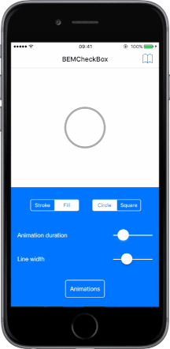

I'm pleased to announce that versions 8.0.0, 9.0.0, and 10.0.0 of the XPlugin.iOS.BEMCheckBox have been released. XPlugin.iOS.BEMCheckBox allows you to use the iOS BEMCheckBox, created by Boris Emorine (Boris-Em), in your MAUI projects.

You can find the releases on NuGet:

[https://www.nuget.org/packages/SaturdayMP.XPlugins.iOS.BEMCheckBox](https://www.nuget.org/packages/SaturdayMP.XPlugins.iOS.BEMCheckBox)

XPlugin project:

[https://github.com/saturdaymp/XPlugins.iOS.BEMCheckBox](https://github.com/saturdaymp/XPlugins.iOS.BEMCheckBox)

BEMCheckBox project:

[https://github.com/saturdaymp/BEMCheckBox](https://github.com/saturdaymp/BEMCheckBox)

The XPlugin.iOS.BEMCheckBox versions now match the .NET version so version 8 targets .NET 8, version 9 targets.NET 9, and so on. Version 8 and onwards use BEMCheckBox v2.2.0, which requires iOS 18 or higher.

I think I have the targeting and minimum iOS versions set up correctly in the project and the NuGet package, but if you spot a mistake, please let me know by opening an issue:

[https://github.com/saturdaymp/XPlugins.iOS.BEMCheckBox/issues](https://github.com/saturdaymp/XPlugins.iOS.BEMCheckBox/issues)

Feel free to open issues for other improvements for either the XPlugin wrapper or BEMCheckbox. Happy coding!
