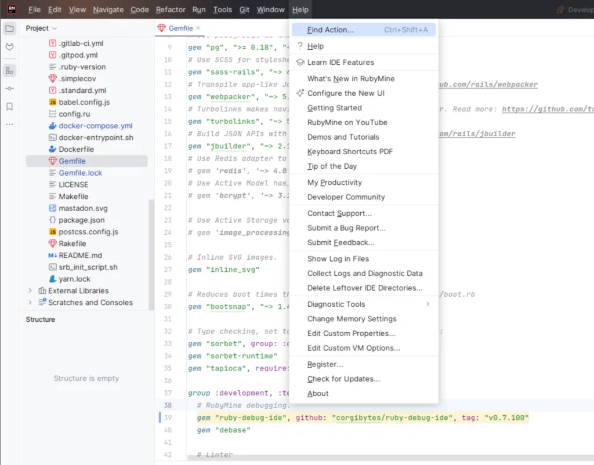
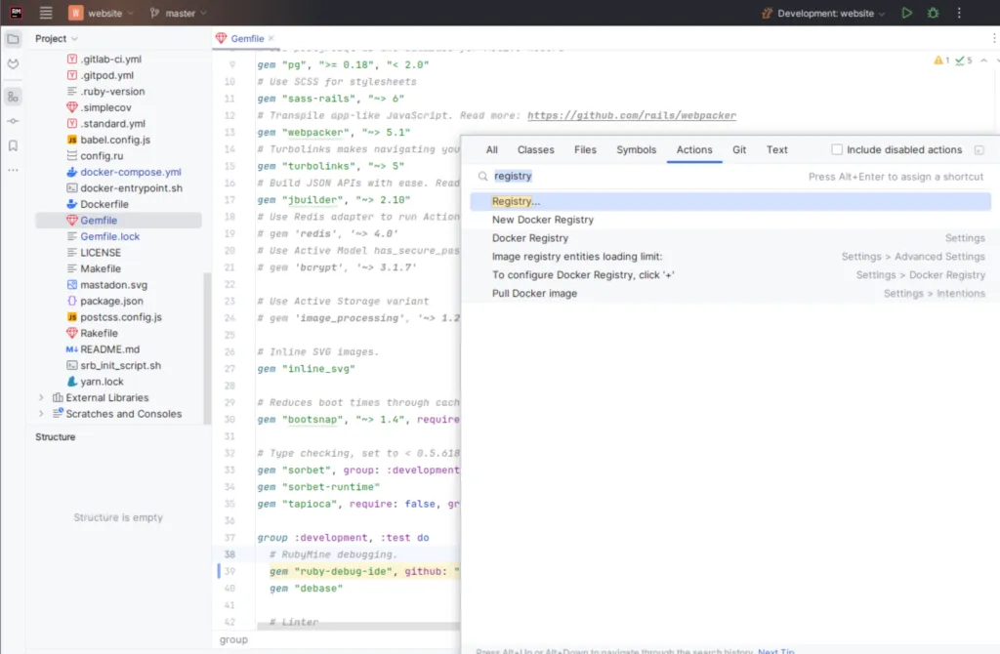
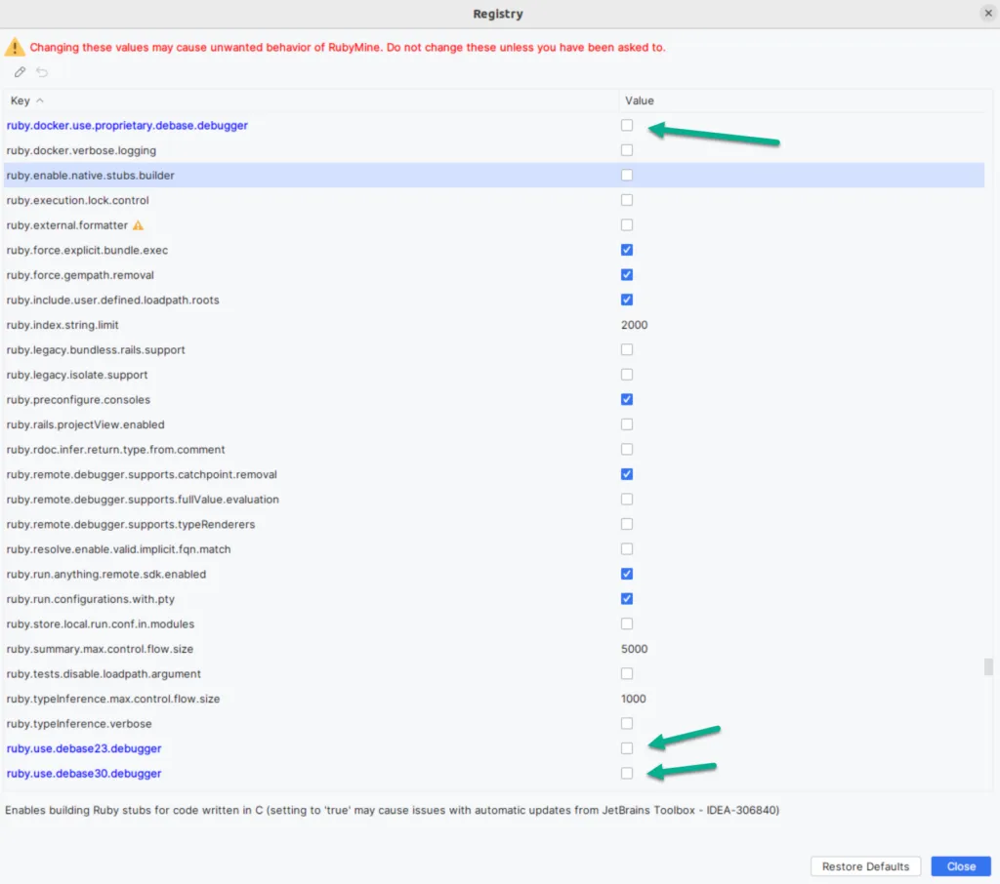

I'm happy to announce that Corgibytes ruby-debug-ide [v0.7.100](https://github.com/corgibytes/ruby-debug-ide/releases/tag/v0.7.100) has been released. This release doesn't fix much from the v0.7.100.rc1 as that release worked just fine. I just finally got around to doing an official release. Check out the [Quick Start](https://github.com/corgibytes/ruby-debug-ide#quick-start) instructions to get started.

The Corgibytes [fork](https://github.com/corgibytes/ruby-debug-ide) of the JetBrains [ruby-debug-ide](https://github.com/ruby-debug/ruby-debug-ide) allows [RubyMine](https://www.jetbrains.com/ruby/) debugging of Rails applications in a [Docker](https://www.docker.com/) container that uses a server that spawns new processes such as [Unicorn](https://yhbt.net/unicorn/) or [Passenger](https://github.com/phusion/passenger). It also allows debugging of Ruby applications that create new processes. It is not required for if Docker is not used or the application being debugged does not spawn new processes.

Please note that with new versions of RubyMine, at least 2023.1 or greater, require the below Registry settings to set to false (e.g. unchecked). You can access RubyMine Registry settings via the Help->Find Actions menu item then enter "Registry".

- ruby.use.debase30.debugger

- ruby.use.debase23.debugger

- ruby.docker.use.proprietary.debase-debugger

You can find more setup and other details [here](https://github.com/corgibytes/ruby-debug-ide). Please open an [issue](https://github.com/corgibytes/ruby-debug-ide/issues) or [PR](https://github.com/corgibytes/ruby-debug-ide/pulls) if you have a question, spot a bug, or have an improvement.

Thanks to [JetBrains](https://www.jetbrains.com/) for creating [RubyMine](https://www.jetbrains.com/ruby/). I use it for most of my Ruby development.
